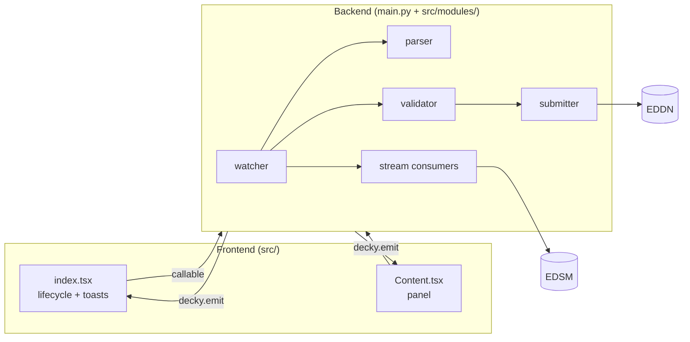

# Developer Guide

How the ED Journal Monitor Decky plugin is put together, what it sends where, and how to build, test and ship it. Repo conventions (testing, changelog, PR workflow, EDDN compliance rules) live in [AGENTS.md](AGENTS.md).

## Development Setup

### Prerequisites

- Node.js 20 (matches CI)
- Python 3.9 (CI's floor; the device runs Decky's embedded Python 3.11). The shipped backend is standard-library only.

```bash
npm install
python3.9 -m venv .venv
.venv/bin/pip install -r requirements-dev.txt   # ruff, pytest, pytest-asyncio, jsonschema — dev only
```

### Build, test, lint

```bash
npm run build       # bundle the frontend to dist/
npm run test        # pytest (or: PYTHONPATH=. .venv/bin/python -m pytest tests/ -v)
npm run lint:ts     # tsc + eslint
npm run lint:py     # ruff + the full pytest suite
```

### Package and install on a device

```bash
npm run package     # build + zip into ed-journal-monitor.zip
scp ed-journal-monitor.zip deck@<your-device>.local:~/Documents/
```

Then in Decky: Developer mode → Browse → select the zip. **Do not** copy files directly into `/home/deck/homebrew/plugins/` — it breaks Decky developer mode.

### Releasing

Follow [the releasing skill](.claude/skills/releasing/SKILL.md). Pushing a `v*` tag on `main` runs `.github/workflows/release.yml`, which lints, tests, packages, and publishes the GitHub Release with notes taken from `CHANGELOG.md`. Its guard logic lives in `scripts/verify-*.sh` / `scripts/extract-release-notes.sh`, each with a matching `tests/test_*.py`.

**Trust model.** Those guards are fast feedback, not an authority against a malicious tagger. The workflow checks out the tagged commit and runs the guards from that same tree, so anyone who can tag an un-PR'd commit can also rewrite the guards in it. A reusable workflow pinned by SHA does not help, since the `uses:` line comes from the same attacker-chosen ref. The real control is GitHub-side: a tag-protection ruleset on `v*` plus a deployment environment with required reviewers on the release job.

## Architecture



- **Frontend → backend** calls go through `callable()`; the full set is declared in `src/api.ts`.
- **Backend → frontend** events go through `decky.emit()`; payload types are in `src/types.d.ts`.
- `main.py` builds every backend component and registers the stream consumers.

### Game lifecycle

1. **ED starts.** `index.tsx` receives `SteamClient.GameSessions.RegisterForAppLifetimeNotifications` and calls `set_ed_running(true)`, which resets session counters and calls `on_session_start()` on every stream consumer. At plugin load, `check_ed_running()` catches a game that was already running: it scans `/proc` for the ED process, then falls back to "a journal file was modified in the last five minutes".
2. **Path discovery.** `find_journal_path()` returns the cached path or scans Steam's `libraryfolders.vdf`; a manually set path is the fallback for non-Steam installs.
3. **Watcher starts.** `start_watcher()` replays any journal files modified since the persisted `last_active` timestamp (or, on first run, the newest file, to pick up commander and game-version state), then polls every 10 s.
4. **Suspend/resume.** `SteamClient.System.RegisterForOnResumeFromSuspend` re-checks status and stops the watcher if uploading was disabled meanwhile.
5. **ED stops.** `set_ed_running(false)` then `stop_watcher()`; the watcher persists `last_active` for the next catch-up, and every consumer gets `on_session_stop()` (EDSM flushes its final batch).

### Journal watching

The journal directory is user-settable and may sit on removable media, so the watcher treats everything in it as untrusted:

- Only regular files within a size cap are opened (a FIFO or device would block the single asyncio loop forever); symlinks to real journals still work.
- File positions are byte offsets. Each poll reads a bounded chunk in a thread executor and dispatches only complete lines, so a line the game is still writing is picked up on the next poll rather than lost.
- Sidecar files (`Market.json`, `Status.json`, …) get the same regular-file and size checks before parsing, and every limit is a named constant in `constants.py`.
- Stopping the watcher (or disabling uploads) during a catch-up replay takes effect at the next line.

### EDDN submission

For each parsed event the watcher:

1. Fans it out to the stream consumers (below) — this never gates EDDN.
2. Drops it unless it is in `REPORTABLE_EVENTS`.
3. Validates it against `REQUIRED_FIELDS` (`validator.py`), which mirrors only each schema's own `required` list.
4. Routes it to the matching transform: journal/1, a sidecar-based schema, or a dedicated schema (tables below). Strict schemas are built by projecting onto an allow-list derived from the pinned schema files (`eddn_allowed_fields.py`); journal/1 strips a disallow-list instead.
5. Submits it (`submitter.py`) with `gameversion`/`gamebuild` in the header and `softwareVersion` from `package.json`. Failures retry up to 3 times, the first no sooner than 60 s, backing off exponentially to 300 s with jitter.

`schema-versions.md` records which upstream schema revisions the plugin was last checked against.

### Stream consumers

Every parsed event is offered to each `StreamConsumer` (`stream_consumer.py`) before the EDDN filter. The protocol is `observe(event, session_state)` plus `name`, `get_stats()`, `on_session_start()` and `on_session_stop()`; route-aware consumers also implement `on_nav_route(route)`, which receives the plotted route from `NavRoute.json` (or an empty list on `NavRouteClear`). The registered consumers are, in `main.py` order:

| Consumer | Module | Purpose |
|---|---|---|
| Session stats | `session_stats.py` | Per-session counters shown in the Session section |
| EDSM forwarder | `forwarders/edsm.py` | Forwards the journal to the user's EDSM account |
| EDSM lookup | `edsm_lookup_consumer.py` | Worth-scanning verdict and system value on arrival |
| EDSM next hop | `edsm_next_hop_consumer.py` | Preview of the next system on the plotted route |

Upload statistics are a per-target map (`{"targets": {"eddn": …, "edsm": …}}`) built by iterating every consumer with `reports_upload_stats = True`, so a third submission target adds itself without UI changes.

### EDSM forwarding

`EdsmForwarder` sends **raw journal lines** (no EDDN transform) to EDSM's `api-journal-v1` under the user's commander name and API key. Setting the key is the consent gate; with no key, nothing is sent. The forwarder:

- skips events on EDSM's discard list (fetched once per session),
- batches by size and time, and force-flushes on session stop and plugin unload,
- serialises flushes so batches arrive in journal order and respect EDSM's rate limiting,
- classifies responses by `msgnum` (1xx OK, 2xx fatal, 5xx transient/retry).

Activity entries are tagged with their target (`eddn`/`edsm`). EDSM entries are recorded per event and only once a batch settles, so both targets count the same unit. **Clear EDSM Credentials** deletes the key and stops forwarding mid-session.

### EDSM navigation aids

All three read EDSM's public API (no key needed) and are gated by the **Enable EDSM lookup** setting, off by default. EDSM only knows what commanders have uploaded, so every result is labelled as EDSM-sourced rather than ground truth.

- **Worth scanning + system value** (`edsm_lookup_consumer.py`). On `FSDJump`/`Location`, it fetches `api-system-v1/bodies` and `api-system-v1/estimated-value` concurrently.
  - Verdict (`edsm_worth_scanning.py`): **green** = unknown to EDSM or no discovered bodies; **yellow** = partly explored; **red** = every body EDSM expects is discovered; neutral when disabled or the lookup fails.
  - Value (`edsm_system_value.py`): EDSM's scan-only estimate (a floor, excluding mapping bonuses) and the top three bodies by value.
  - A green verdict (or yellow, if the user chose that threshold) raises a Steam toast from `index.tsx` when worth-scanning notifications are on.
- **Next in route** (`edsm_next_hop.py`, `edsm_next_hop_consumer.py`). It finds the entry after the current system on the plotted route and runs the same two lookups for it. Scoopability comes from the route's `StarClass` (K, G, B, F, O, A, M), so it is shown even when EDSM has no data.
- **Nearest scoopable star** (`edsm_nearest_scoopable*.py`). An on-demand button that queries `api-v1/sphere-systems` within 25 ly and picks the closest system whose primary star EDSM flags as scoopable.

Lookups go through one shared per-system cache (`edsm_system_cache.py`: 4 h TTL, LRU-bounded), so a previewed next hop is a cache hit on arrival. Each consumer caps its in-flight lookups; a new arrival cancels the oldest. Every HTTP response body, EDDN's and EDSM's alike, is read through `http_read.read_capped_body()`, and an over-sized body is treated as a failed request.

### Panel

`Content.tsx` is ordered by how often each part is read:

1. **Health strip** — one worst-first status line (journal path, ED running, watcher, uploads enabled).
2. **Navigation** — current system, verdict, value, next hop, nearest-scoopable button. Always visible.
3. **Session** — counters. Always visible.
4. **Data flow** — per-target upload counts and one merged activity/failure feed. Collapsed, but starts expanded when there are failures.
5. **Setup** — Journal path, EDDN, EDSM account, EDSM lookups, each independently collapsible.
6. **Troubleshooting** — detailed logging, diagnostic bundle.

`@decky/ui` has no collapsible primitive, so `CollapsibleSection` is local. Collapsed content is not rendered at all, so it adds no gamepad focus stops. Collapse state resets each time the panel opens.

### Settings and diagnostics

- `settings.json` is written atomically with owner-only permissions (0600 file, 0700 directory) because it holds the EDSM API key. The key field is masked in the panel, which shows up in screenshots and Remote Play.
- The diagnostic bundle (`diagnostics.py`) redacts secret settings and shortens home-directory paths to `~`. `uploader_id` is left as-is because it is already sent publicly to EDDN.

## EDDN Event Coverage

Upload endpoint: `https://eddn.edcd.io:4430/upload/`, header `softwareName: ED Journal Monitor Decky`. The authoritative mapping is `REPORTABLE_EVENTS`, `AUXILIARY_FILES` and `DEDICATED_SCHEMA_EVENTS` in `src/modules/constants.py`; required fields per event are `REQUIRED_FIELDS` in `validator.py`.

Across all schemas: `StarPos`/system-name augmentation from session state happens only when the event's `SystemAddress` matches the current system (so coordinates are never stale), and `horizons`/`odyssey` are sent only once `LoadGame` has reported them.

### [journal/1](https://github.com/EDCD/EDDN/blob/live/schemas/journal-README.md)

| Event | Notes |
|-------|-------|
| FSDJump, Location, CarrierJump | Carry their own `StarPos` |
| Scan, Docked, SAASignalsFound | `StarPos`/`StarSystem` augmented from session state |

Fields EDDN disallows (and `_Localised` keys) are stripped.

### Sidecar-based schemas

These events read a JSON file the game writes alongside the journal:

| Journal Event | Sidecar | Schema | Notes |
|---------------|---------|--------|-------|
| Market | `Market.json` | [commodity/3](https://github.com/EDCD/EDDN/blob/live/schemas/commodity-README.md) | Sends `stationType`, and `carrierDockingAccess` when present; status flags deduped |
| Outfitting | `Outfitting.json` | [outfitting/2](https://github.com/EDCD/EDDN/blob/live/schemas/outfitting-README.md) | Modules deduped; `Int_PlanetApproachSuite` elided |
| Shipyard | `Shipyard.json` | [shipyard/2](https://github.com/EDCD/EDDN/blob/live/schemas/shipyard-README.md) | Ships deduped |
| NavRoute | `NavRoute.json` | [navroute/1](https://github.com/EDCD/EDDN/blob/live/schemas/navroute-README.md) | System fields only inside `Route[]` |
| FCMaterials | `FCMaterials.json` | [fcmaterials_journal/1](https://github.com/EDCD/EDDN/blob/live/schemas/fcmaterials_journal-README.md) | Skipped when `Items` is empty |

If the sidecar isn't there yet, the read is retried a few times within the same poll cycle.

### Dedicated schemas

| Event | Schema | Notes |
|-------|--------|-------|
| FSSSignalDiscovered | [fsssignaldiscovered/1](https://github.com/EDCD/EDDN/blob/live/schemas/fsssignaldiscovered-README.md) | Batched; flushed on the next system-changing or session-ending event (`SignalBatcher.FLUSH_TRIGGER_EVENTS`) |
| FSSDiscoveryScan | [fssdiscoveryscan/1](https://github.com/EDCD/EDDN/blob/live/schemas/fssdiscoveryscan-README.md) | `StarPos`/`SystemName` augmented |
| ApproachSettlement | [approachsettlement/1](https://github.com/EDCD/EDDN/blob/live/schemas/approachsettlement-README.md) | `StationName` → `Name`; keeps `Latitude`/`Longitude`; `StarPos`/`StarSystem` augmented |
| CodexEntry | [codexentry/1](https://github.com/EDCD/EDDN/blob/live/schemas/codexentry-README.md) | `System`/`StarPos` augmented; `BodyName` taken from `Status.json` only when its timestamp is within 60 s of the event; `BodyID` only when the journal agrees on the body; otherwise both omitted |
| NavBeaconScan | [navbeaconscan/1](https://github.com/EDCD/EDDN/blob/live/schemas/navbeaconscan-README.md) | `StarPos`/`StarSystem` augmented |
| FSSAllBodiesFound | [fssallbodiesfound/1](https://github.com/EDCD/EDDN/blob/live/schemas/fssallbodiesfound-README.md) | `StarPos`/`SystemName` augmented |
| ScanBaryCentre | [scanbarycentre/1](https://github.com/EDCD/EDDN/blob/live/schemas/scanbarycentre-README.md) | `StarPos`/`StarSystem` augmented; dropped if `StarPos` is unknown |
| FSSBodySignals | [fssbodysignals/1](https://github.com/EDCD/EDDN/blob/live/schemas/fssbodysignals-README.md) | `StarPos`/`StarSystem` augmented; dropped if either is unknown |
| DockingGranted | [dockinggranted/1](https://github.com/EDCD/EDDN/blob/live/schemas/dockinggranted-README.md) | Station context; no `StarPos` |
| DockingDenied | [dockingdenied/1](https://github.com/EDCD/EDDN/blob/live/schemas/dockingdenied-README.md) | Station context; no `StarPos` |

## Known Limitations

- **Polling, not inotify.** New events can take up to 10 s to be picked up.
- **SSL on device.** Decky's embedded Python may not find system CA certs; `ssl_context.build_ssl_context()` tries the environment, certifi and common system paths, but may still fail on unusual configurations.
- **`/proc` detection.** The kernel truncates process names to 15 characters (`EliteDangerous64.exe` → `EliteDangerous6`); detection of an already-running game may break if Frontier renames the executable. The journal-modified-time fallback still applies.
- **SteamClient availability.** `SteamClient.GameSessions` and `SteamClient.System` may be undefined on some SteamOS versions; lifecycle or suspend handling is then disabled.
- **In-memory state.** The activity log (last 50 entries) and any un-flushed `FSSSignalDiscovered` batch are lost on plugin reload.
- **EDSM data is crowd-sourced.** Verdicts, values and sphere results reflect only what commanders have uploaded.
